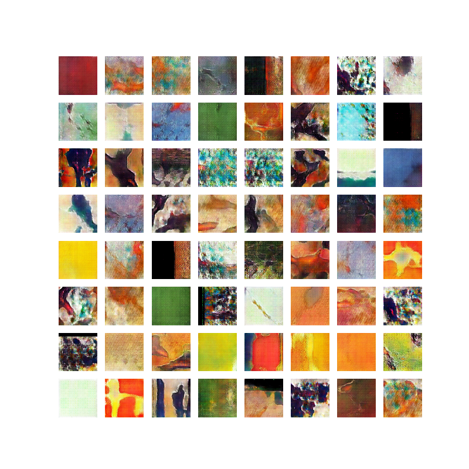
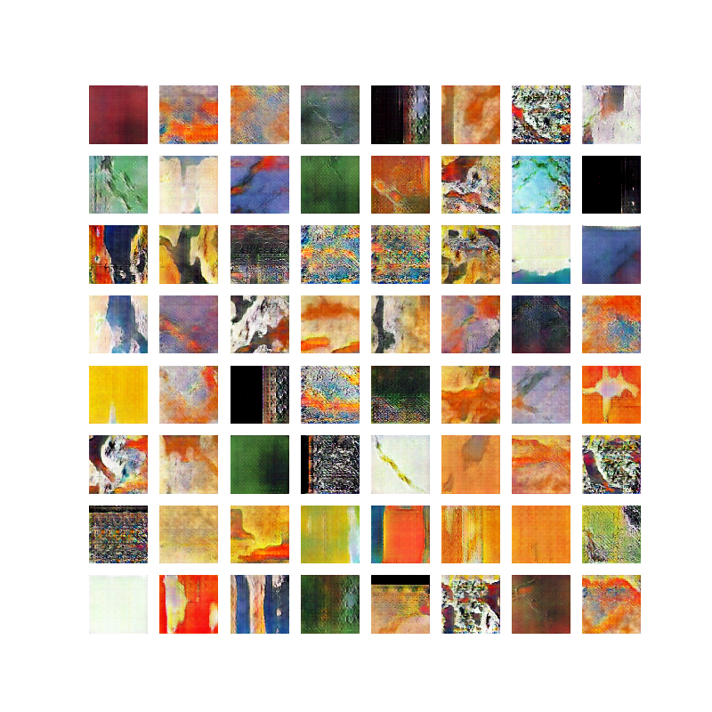
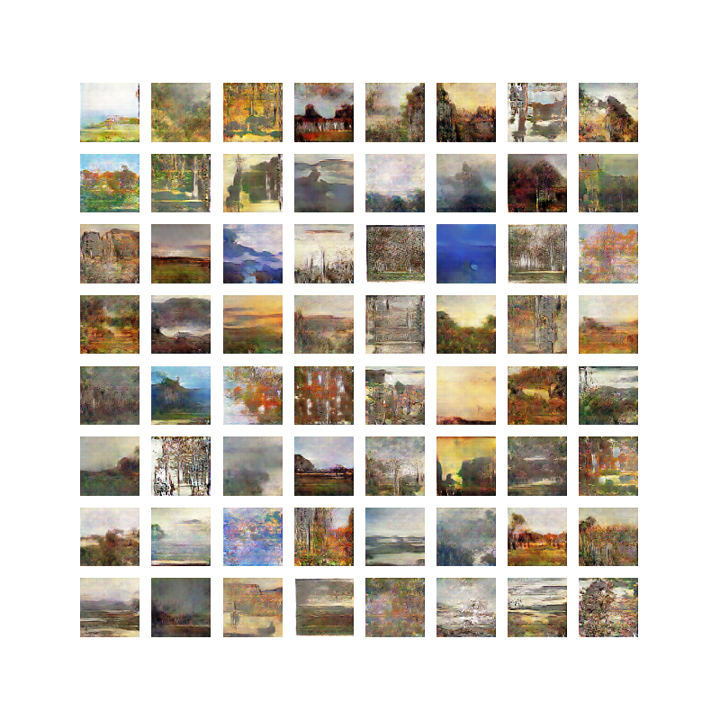
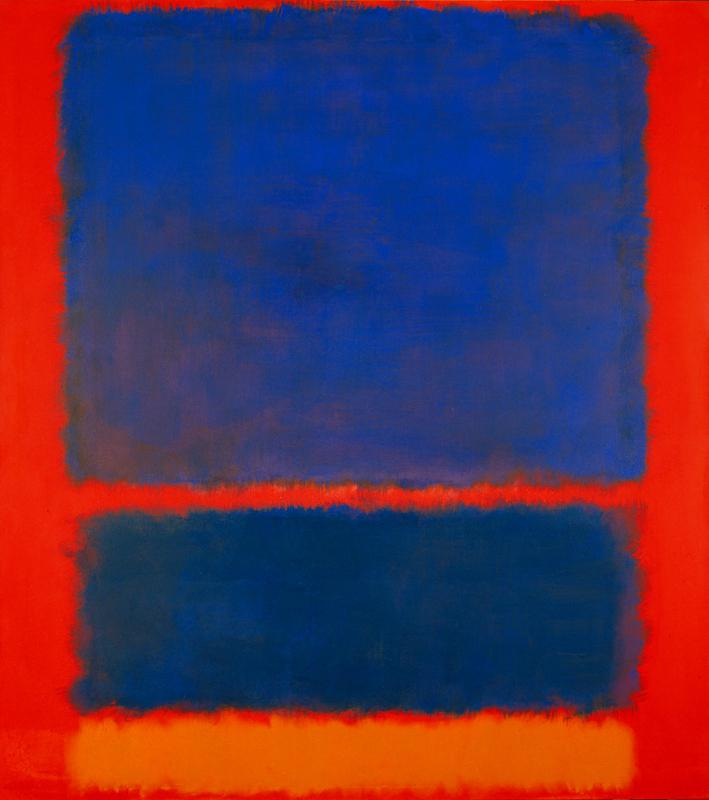
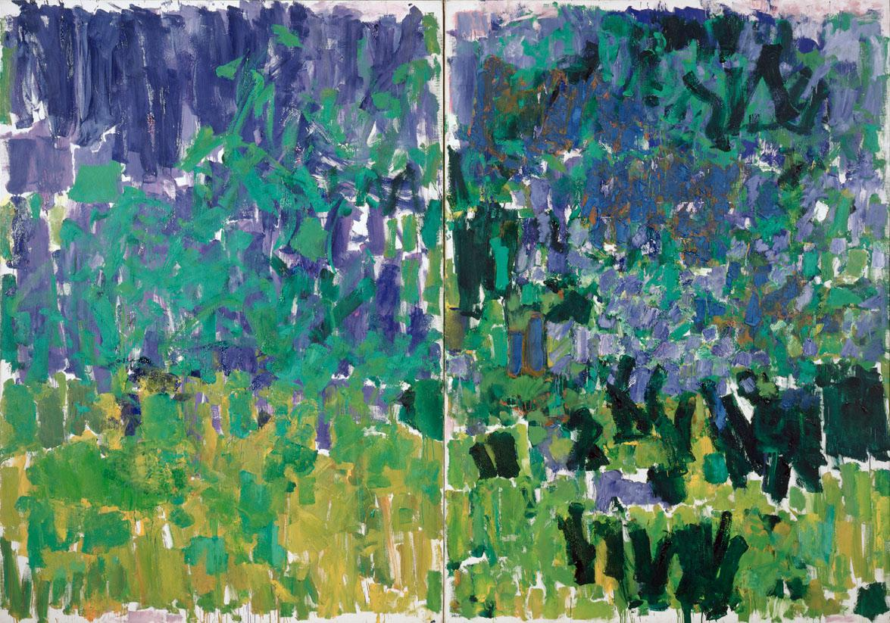
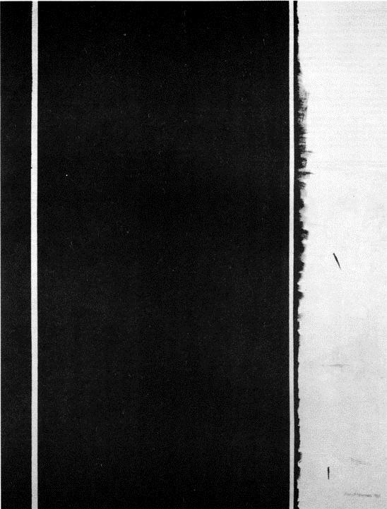

# abstract-DCGAN

## Starting

**requires python3 and pip**

```
> python3 --version
Python 3.7.3
> pip --version
pip 20.0.2
```

Note you do not need to be running Python 3.7, but > version 3.5 is recommended

### Starting virtual environment and installing dependencies

```bash
> venv abstract-DCGAN
> cd abstract-DCGAN
> source bin/activate
> pip install -r requirements.txt
```

Make sure you have tensorflow installed

```bash
python3
>>> import tensorflow as tf
>>> tf.__version__
'2.1.0'
```

In order to run jupyter notebooks with Python 3, do the following to install Python 3 in your notebook environment:

```bash
python2 -m pip install ipykernel
python2 -m ipykernel install --user

python3 -m pip install ipykernel
python3 -m ipykernel install --user
```

Launch your jupyter notebook and click "New" in the upper right corner to ensure that you are able to make a new Python 3 file.

```bash
jupyter notebook
```

## Results

### Trained on dataset of Abstract paintings for 100 epochs



### Trained on dataset of Landscape paintings for 100 epochs


## Example Training Data
  

Mark Rothko, *Blue, Orange, Red*, 1961  

  

Joan Mitchell, *Posted*, 1977  

  

Barnett Newman, *Twelfth Station*, 1965
